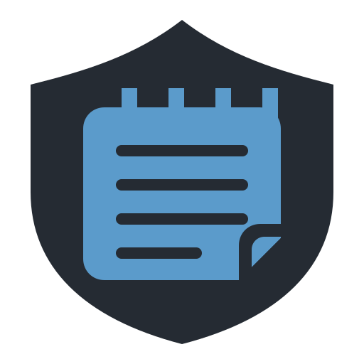

<p align="center">
  
</p>

<h1 align="center">DetectPad</h1>

<p align="center"><em>A notepad that screen sharing can't see.</em></p>

DetectPad is a minimal Windows desktop notepad for jotting sensitive notes that should never
leak through screen sharing, screen recording, or screenshots. It is a single window with one
plain-text, word-wrapped note area, nothing else.

This repository distributes the DetectPad binary only; the source code is not public.

## What it does

- Excludes its own window from screen capture, so it does not appear in screenshots, screen
  recordings, or live screen shares (Zoom/Teams/Meet/etc.).
- Provides a global panic hotkey, **Ctrl+Alt+H**, that instantly hides the window - even when
  DetectPad does not have keyboard focus - and restores it to its prior position, size, and
  state when pressed again. Any unsaved text is saved before the window hides.
- Autosaves your note as you type, so you never have to remember to save.
- Follows the Windows system light/dark app theme by default, with a compact toggle to
  override it; your choice is remembered across restarts.
- Shows a slim status bar with privacy-mode status, autosave state, and the currently
  registered panic hotkey.

## Privacy model - read this

DetectPad's protection is **capture-exclusion plus panic-hide only**:

- **What it protects against:** the note window being visible in screenshots, screen
  recordings, or live screen shares, and shoulder-surfing via the panic hotkey instantly
  concealing the window.
- **What it does NOT protect against:** the note content is stored as **plain text and is NOT
  encrypted at rest**. Anyone with access to your filesystem, a backup of it, or the running
  process's memory can read the note directly. There is no secure-delete and no memory
  scrubbing. If your threat model includes filesystem or device access by another party, this
  tool alone is not sufficient.
- If your OS does not support capture exclusion (see Requirements below), DetectPad shows a
  one-time warning that privacy mode is unavailable and continues to run unprotected.

## Default hotkey

**Ctrl+Alt+H** toggles hide/show of the main window. This is a fixed default in v1; there is no
remapping UI. If another application has already registered this combination, DetectPad cannot
register it either, and the status bar will indicate that the hotkey is unavailable.

## Storage location

Notes are saved as UTF-8 plain text at a fixed path:

```
%APPDATA%\DetectPad\note.txt
```

There is a single implicit document: each save overwrites the file (no versioning, no
backups, no multi-note support).

The selected theme mode is persisted alongside the note at `%APPDATA%\DetectPad\settings.json`.

## Download

Direct download: <https://github.com/gengen1255/detectpad-releases/releases/latest/download/DetectPad.exe>

Latest release page: <https://github.com/gengen1255/detectpad-releases/releases/latest>

No installer and no separate .NET runtime install is needed - the exe is self-contained. It is
about 62 MB, a compressed single-file executable, so the first launch is a little slower than
usual while it unpacks itself; later launches are fast.

## Requirements

- Windows 10 or 11, x64.
- Windows 10 version 2004 (build 19041) or later is required for capture exclusion to take
  effect. On older Windows versions DetectPad still runs, but the window is not protected from
  capture.

## Windows SmartScreen

The exe is unsigned, so Windows SmartScreen will likely show "Windows protected your PC" the
first time you run it. Click **More info**, then **Run anyway** to continue. This is expected
for an unsigned indie binary and is not a sign of tampering.

## Antivirus

Because DetectPad excludes its own window from screen capture, some antivirus software may
occasionally flag it as a false positive. If yours blocks the download or the exe, you may need
to allow it manually.

## Non-goals (v1)

No encryption at rest, no multi-note/tabs, no tray icon, no find/replace, no settings UI beyond
the theme toggle, no high-contrast theme, no font settings, and no macOS/Linux support.
